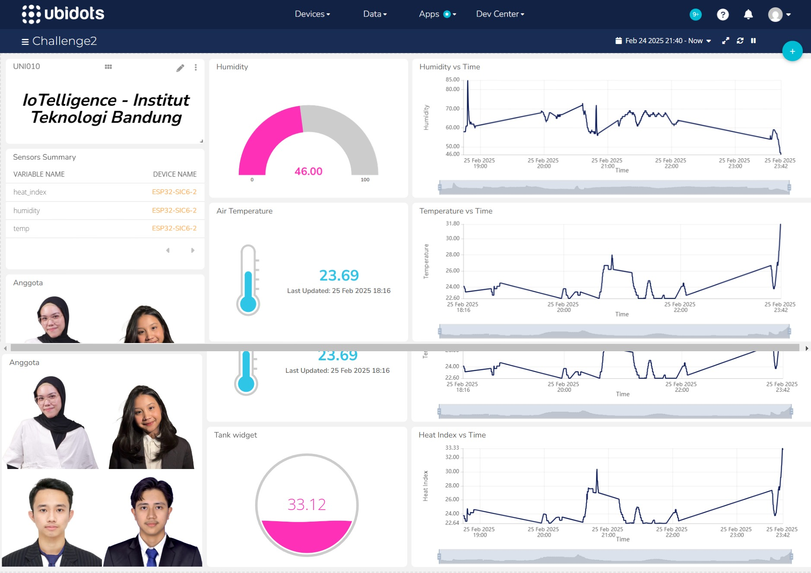

# Assignment 2 SIC6 : ESP32 IoT Data Logger with Flask API and MongoDB

<div align="center" id="contributor">
  <strong>
    <h3>Dibuat oleh Tim IoTelligence</h3>
    <table align="center">
      <tr>
        <td>Nama</td>
        <td>Email</td>
      </tr>
      <tr>
        <td>Marzuli Suhada M</td>
        <td>azulsuhada13@gmail.com</td>
     </tr>
     <tr>
        <td>Ahmad Mudabbir Arif</td>
        <td>ahmadmudabbir03@gmail.com</td>
    </tr>
     <tr>
        <td>Jihan Aurelia</td>
        <td>jihanaurelia2004@gmail.com</td>
    </tr>
    <tr>
        <td>Nasywaa Anggun Athiefah</td>
        <td>nasywaa.anggun@gmail.com</td>
    </tr>
    </table>
  </strong>
</div>

## Overview
Proyek ini bertujuan untuk membaca data suhu dan kelembapan dari sensor DHT11 yang terhubung ke ESP32, lalu mengirimkan data tersebut ke server Flask API. Data yang diterima akan disimpan di MongoDB Atlas untuk analisis lebih lanjut.


---

## 🚀 Fitur

- 📡 **Koneksi ESP32 ke WiFi**
- 🌐 **Mengirim data sensor ke Flask API menggunakan HTTP POST**
- 💾 **Menyimpan data suhu dan kelembapan ke MongoDB Atlas**
- 📊 **Menyediakan REST API untuk mengambil data**
- 🔐 **Mendukung MongoDB Atlas untuk penyimpanan berbasis cloud**

---

## 🛠️ Teknologi yang Digunakan

- **ESP32** (microcontroller)
- **DHT11** (sensor suhu dan kelembapan)
- **Arduino IDE** (untuk pemrograman ESP32)
- **Python** (backend server)
- **Flask** (REST API)
- **PyMongo** (untuk koneksi MongoDB)
- **MongoDB Atlas** (database cloud)

---

## ⚙️ Instalasi

### 1. Clone Repository

```bash
git clone https://github.com/nasywaanaa/Assignment2-SIC6-IoTelligence.git
cd Assignment2-SIC6-IoTelligence
```

### 2. Siapkan Virtual Environment Python
```bash
python -m venv venv
source venv/bin/activate  # Untuk Mac/Linux
venv\Scripts\activate     # Untuk Windows
```

### 3. Jalankan Flask API
```bash
python server.py
```

## 📡 Konfigurasi ESP32
### 1. Library yang Dibutuhkan (Install via Arduino IDE Library Manager)
- DHT sensor library
- WiFi.h (library bawaan ESP32)
- Sketch -> Include Library -> add zip library (Ubidots ESP32 Main.zip)

### 2. Upload Kode ESP32
- Sambungkan ESP32 ke komputer.
- Gunakan Arduino IDE untuk meng-upload kode dari file esp32_sensor.ino.

### 3. Update Server URL
Ganti alamat IP lokal Flask API di kode ESP32:
```bash
const char* SERVER_URL = "http://192.168.18.217:5000/";
```